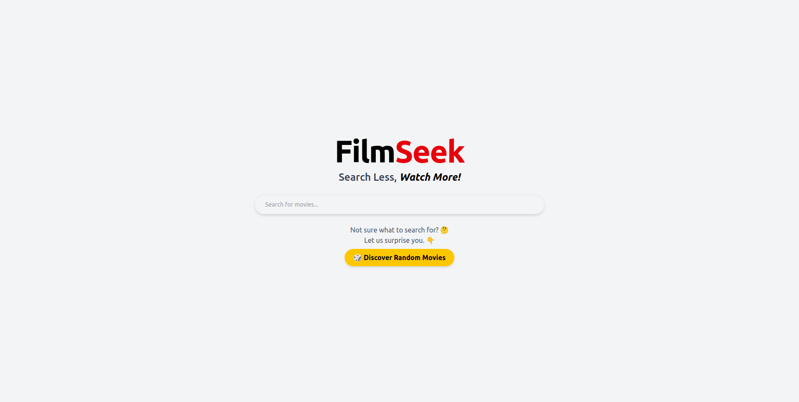
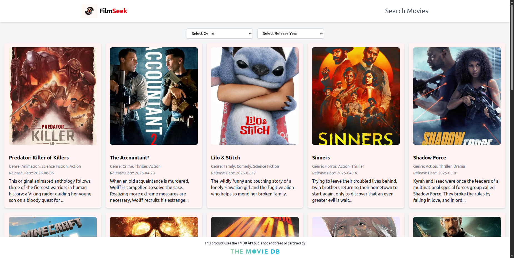

# 🎬 FilmSeek

**FilmSeek** is a modern web app that allows users to search and filter movies using data from [The Movie Database (TMDB)](https://www.themoviedb.org/). It supports searching by title, filtering by genre and release year, and displays results in an intuitive, card-based layout.

---

## 🚀 Features

* 🔍 Search for movies by name
* 🎭 Filter by genre
* 📅 Filter by release year
* 🎞️ Responsive movie cards with posters and details
* ⚡ Built with React, TypeScript, Tailwind CSS, and TMDB API

---

## 📸 Screenshots

### Search View


### Result View


---

## 🛠️ Tech Stack

* **Framework**: React + Vite
* **Language**: TypeScript
* **Styling**: Tailwind CSS v4
* **API**: TMDB (The Movie Database)
* **Others**: GitHub Issues, Uizard (UI Design)

---

## 🧱 Folder Structure
```bash
public/
├── screenshots/
src/
├── assets/ # Images, icons
├── components/ # Reusable UI components (Header, SearchBar, FilterPanel, MovieCard)
├── pages/ # Top-level page(s)
├── services/ # API interaction (movieApi.ts)
├── views/ # View-level UI (SearchView, ResultView)
├── App.tsx
├── main.tsx
└── index.css
```
---
## 🧪 How to Run Locally

  ### 1. Clone the repository

  ```bash

  git clone https://your-GitHub-token@github.com/your-username/FilmSeek.git

  cd filmseek
  ```
  ### 1. Install dependencies using your preferred package manager

  ```bash
  npm install
  ```
  ### 3. Create a `.env` file
  ```bash
  VITE_TMDB_API_KEY=your_tmdb_api_key_here
  ```
  ### 4. Start the development server using your preferred package manager

  ```bash
  npm run dev
  ```
---

## 📁 Environment Variables

| Variable                         | Description            |
| -------------------------------- | ---------------------- |
| VITE\_TMDB\_API\_KEY             | Your API key from TMDB |

---

## 👥 Contributing

Want to improve FilmSeek? Here's how to get started:

1. Fork the repo
2. Create your feature branch: `git checkout -b feature/YourFeature`
3. Commit your changes: `git commit -m 'Add YourFeature'`
4. Push to the branch: `git push origin feature/YourFeature`
5. Create a pull request

---

## 👍 Credits

* Task provided by [UPTICK TALENT](https://upticktalent.africa)
* Movie data provided by [TMDB](https://www.themoviedb.org/)
* Design inspired by clean UX practices and prototyped with Uizard
* Friends for testing and suggesting improvements for the app

---

## 📄 License

This project is licensed under the MIT License.

---

## ✨ Author

**Solomon C. Nwante** – [@CNwante](https://twitter.com/CNwante)
